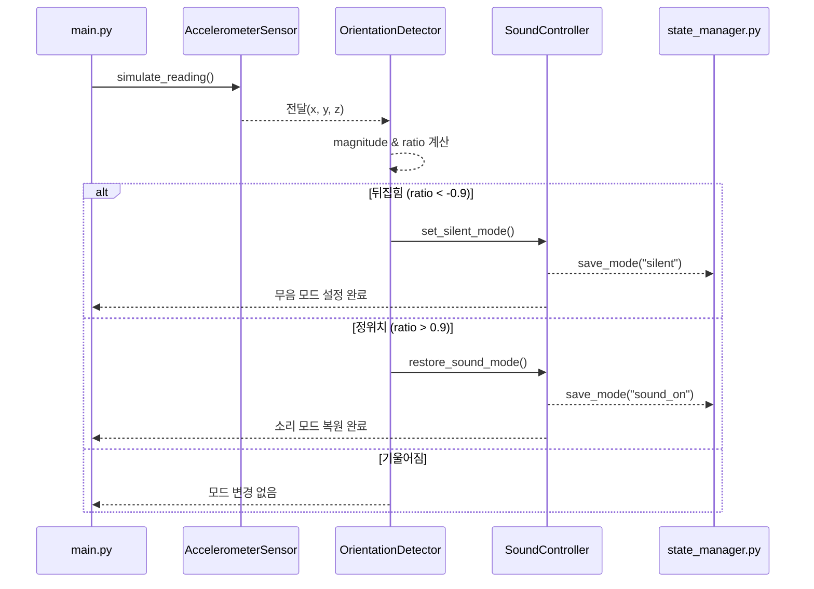
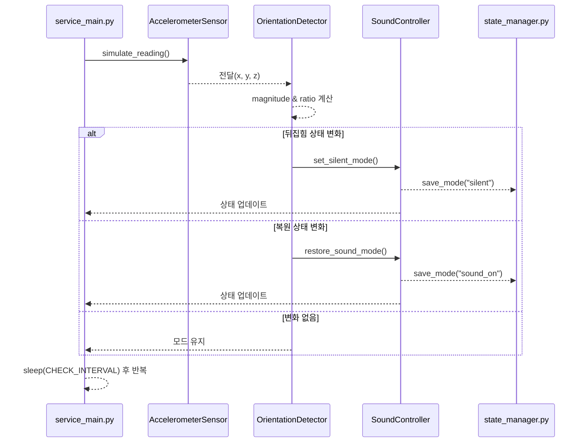

# 자동 무음 모드 전환 시뮬레이션
휴대폰을 뒤집었을 때 자동으로 소리가 꺼지고, 다시 뒤집으면 소리가 켜지는 동작을 시뮬레이션합니다. 장치 내 가속도계 센서 데이터를 활용해 현재 방향을 판별하며, 실행이 끝난 뒤에도 마지막 사운드 모드 상태를 유지합니다.
- main.py: 한 번만 감지 후 동작 수행 후 종료
- service_main.py(백그라운드 서비스): 무한 루프에서 주기적으로 감지 후 상태 변화 시 동작 수행

# 시퀀스 다이어그램
## 한 번 실행 (main.py)


## 백그라운드 서비스 (service_main.py)


# 모듈 평가
## 응집도
각 모듈이 오직 한 가지 책임만 수행하도록 설계되어, 내부 로직이 해당 역할에만 집중합니다.
- state_manager.py
  프로그램의 사운드 상태를 state.json 파일에 기록하고 불러오는 역할을 담당합니다.
- accelerometer_sensor.py
  x, y, z 축의 을 생성해 제공하는 역할을 합니다.
- orientation_detector.py
  가속도 벡터 전체 크기 대비 z축의 비율을 계산해 “뒤집힘/정위치/기울어짐”을 판단합니다.
- sound_controller.py
  이전에 저장된 모드를 불러오고, 필요 시 무음및 사운드 모드로 전환합니다.
- main.py
  단일 실행 흐름(감지 -> 판단 -> 모드 전환 -> 종료)을 담당합니다.
- service_main.py
  백그라운드에서 주기적으로 감지하고, 상태 변화가 있을 때만 모드를 업데이트합니다.

모든 파일이 자신의 역할에만 집중하도록 나누었기 때문에 응집도가 높습니다.

## 결합도

- main.py와 service_main.py는 생성자를 통해 필요한 컴포넌트를 받아 사용하며, 외부 구현체에 직접 접근하지 않습니다.
- 각 모듈이 제공하는 공용 메서드만 호출해 작동하므로, 다른 모듈의 코드를 수정할 필요 없이 교체또는 확장이 가능합니다.
- 센서 시뮬레이터나 상태 저장 방식을 바꿔도 나머지 코드에 미치는 영향이 거의 없어 낮은 결합도를 유지합니다.

# 파일 구조
```
PROJECT/
   accelerometer_sensor.py   (가속도계 시뮬레이션)
   main.py                   (한 번 실행 스크립트)
   orientation_detector.py   (방향 판단)
   service_main.py           (백그라운드 서비스 스크립트)
   sound_controller.py       (사운드 모드 제어)
   state_manager.py          (모드 상태를 저장 및 로드)
```